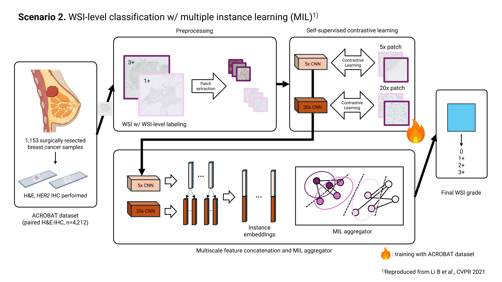

# Breast Cancer WSI Classification
This work is a variation of `https://github.com/binli123/dsmil-wsi`, adapting the ACROBAT dataset to fit the breast cancer classification task. 

Although the code has been slightly modified, the basic model structure is the same as the original author's model. 

 ([Dual-stream Multiple Instance Learning Network for Whole Slide Image Classification with Self-supervised Contrastive Learning](https://arxiv.org/abs/2011.08939) [CVPR 2021, accepted for oral presentation]).



## Prerequisites
The codes below are written for Linux OS. 

### Git Clone

```bash
# 'bci_ai' git repository download
git clone https://github.com/orangingq/bci_ai.git
# move to the downloaded bci_ai folder
cd bci_ai
```

### Anaconda Environment

```bash
# create 'bci_ai' environment 
    conda env create --file environment/conda_env.yml
# activate the environment
conda activate bci_ai
```

## Download Dataset

- ACROBAT : https://snd.se/en/catalogue/dataset/2022-190-1

#### 1. Your downloaded ACROBAT dataset should follow below structure:

```
BCI_AI (root directory)
    └── dataset
        └── acrobat
            ├── meta_data 
            │   └── acrobat_label.csv
            ├── train 
            │   └── xxx_{img_type}_train.tif
            ├── valid 
            │   └── xxx_{img_type}_valid.tif
            └── test
                └── xxx_{img_type}_test.tif
```

#### 2. Place ACROBAT WSI files as `datasets\acrobat\[CATEGORY_NAME]\[SLIDE_NAME].tif`.
Rename the negative class (0) to 'neg'. 
```
BCI_AI (root directory)
    └── dataset
        └── acrobat
            ├── 1 # class 1
            │   └── xxx_{img_type}_{type}.tif
            ├── 2 # class 2
            │   └── xxx_{img_type}_{type}.tif
            ├── 3 # class 3
            │   └── xxx_{img_type}_{type}.tif
            └── neg # class 0
                └── xxx_{img_type}_{type}.tif
```

## How to Run? (WSI Classification using DSMIL)


#### 1. Crop patches.
  - **default setting** : 10x, 2.5x magnification (-m 1 3 -b 20 -d acrobat -v tif)
    ```bash 
    python -m deepzoom_tiler --type=train 
    python -m deepzoom_tiler --type=test 
    ```
  - other options (ex. 10x magnification only)
    ```bash
    python -m deepzoom_tiler -m 1 -b 20 -d acrobat -v tif 
    ```

#### 2. Train a SimCLR embedder.
    
Move to simclr directory first. (`cd simclr`)
**Code Examples**
- Backbone ResNet18, train from scratch
  ```bash
  python run.py --level=high --batch_size=256 --epoch=20 --log_dir=resnet18_scratch_high
  python run.py --level=low --batch_size=256 --epoch=50 --log_dir=resnet18_scratch_low
  ```
  > Model weights will be saved in `simclr/runs/{log_dir}`

  > `--level=high` for 10x magnification (higher mag.) images, `--level=low` for 2.5x magnification (lower mag.) images

- Backbone ResNet50, finetune based on the ImageNet pretrained weights
  ```bash
  python run.py --level=high --batch_size=128 --epoch=20 --model=resnet50 --pretrained --log_dir=resnet50_finetune_high
  python run.py --level=low --batch_size=128 --epoch=50 --model=resnet50 --pretrained --log_dir=resnet50_finetune_low
  ```
  > This training process (especially for bigger models) might take a day. 

#### 3. Compute features using the embedder.

Move back to bci_ai folder. (`cd ..`)

**Code Examples**

> Add `--type=test` option when computing features of test dataset.

> Put `weights_name` after the weights option `--weights_low={weights_name}`, which you put when training SimCLR at Step 3 (`--log_dir={weights_name}`). 

> You need to set the norm layer as batch norm (`--norm_layer=batch`) when finetuning / using pretrained ImageNet weights. 

> The computed features will be saved at `datasets/features/{run_name}`.

- Example 1 : using SimCLR of ResNet18 as backbone & pretrained on ImageNet
  ```bash
  python -m compute_feats --weights_low=ImageNet --weights_high=ImageNet --backbone=resnet18 --norm_layer=batch --batch_size=256 --run_name={resnet18_imgnet}
  ```

- Example 2 : using SimCLR of ResNet18 as backbone & finetuned with ACROBAT based on ImageNet pretrained weights

  ```bash
  python -m compute_feats --weights_low={resnet18_finetune_low} --weights_high={resnet18_finetune_high} --backbone=resnet18 --norm_layer=batch --batch_size=256 --run_name={resnet18_finetune}
  ```


- Example 3 : using SimCLR of ResNet50 as backbone & trained from the scratch on ACROBAT

  ```bash
  python -m compute_feats --weights_low={resnet50_scratch_low} --weights_high={resnet50_scratch_high} --backbone=resnet50 --norm_layer=batch
  ```
  > If you don't specify `run_name` option, it will automatically follow the weights name. 

#### 4. Training.

```bash
python -m train --run_name={resnet18_scratch}
```
> Set `run_name` option as you put in step 4. 