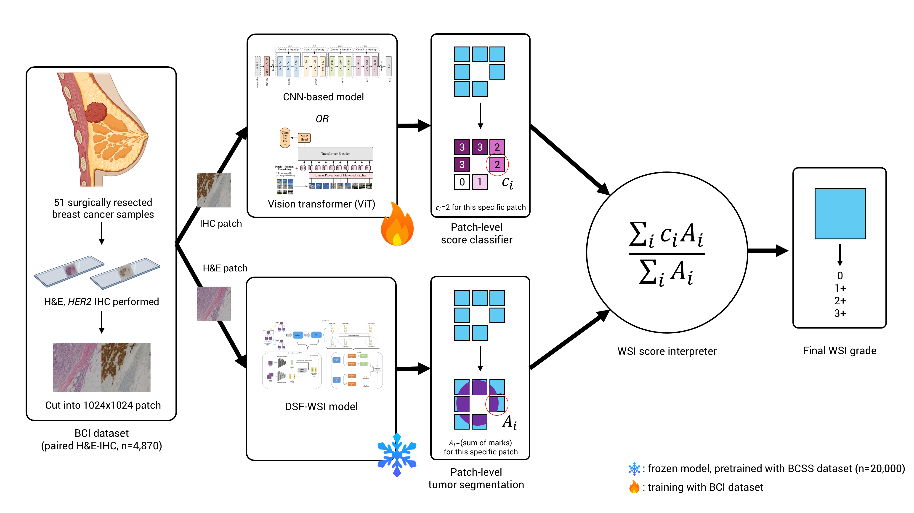

# Breast Cancer Classification



## Anaconda Environment

```bash
# 콘다 가상환경 생성 ('bci_ai')
conda env create --file environment.yml
# bci_ai 가상환경 활성화
conda activate bci_ai
```

## Download Dataset

Your downloaded dataset (ACROBAT, BCI dataset) should follow below structure:

```
BCI_AI (root directory)
    └── dataset
        ├── acrobat
        │   └── train
        │       └── xxx_{img_type}_train.tif
        │
        └── BCI_dataset
            ├── HE
            │   ├── train
            │   │   └── xxxxx_train_#.png
            │   └── test
            │       └── xxxxx_test_#.png
            └── IHC
                ├── train
                │   └── xxxxx_train_#.png
                └── test
                    └── xxxxx_test_#.png
```

## Download Pretrained segmentation model weight

```bash
# Download
wget https://github.com/Dylan-H-Wang/msf-wsi/releases/download/v0.1/bcss_fold0_ft_model.pth.tar
# move file into 'utils' directory
mv bcss_fold0_ft_model.pth.tar BCSS_segmentation/bcss_fold0_ft_model.pth.tar
```

## How to Run?

```python
CUBLAS_WORKSPACE_CONFIG=:16:8 python -m main --{optional arguments}
```

`CUBLAS_WORKSPACE_CONFIG=:16:8` is added to fix the random seed.

Only valid in CUDA environment. Not tested in CPU only case.

#### Ex. To use pretrained (w/o finetuning) model for classification task

```bash
CUBLAS_WORKSPACE_CONFIG=:16:8 python -m main --model_name=ViT
```

#### Ex. To finetune the classification model with AdamW optimizer

```bash
CUBLAS_WORKSPACE_CONFIG=:16:8 python -m main --finetune --optimizer_name=AdamW
```

### Options

- `seed :int = 42`
- `dataset :str = 'BCI_dataset'`
- `image_size :int = 224`
- `model_name :str = 'ViT'`
  - one of 'ViT' / 'ResNet18' / 'ResNet34' / 'ResNet50' / 'ResNet101'
- `optimizer_name :str = 'Adam'`
  - one of 'Adam' / 'AdamW'
- `learning_rate :float = 1e-3`
- `log_freq :int = 30`
  - log accuracy every `log_freq` batches
- `finetune :bool = False`
- `load_dir :str = None`
  - default : load pretrained weight
- `save_dir :str = None`
  - default : not save
